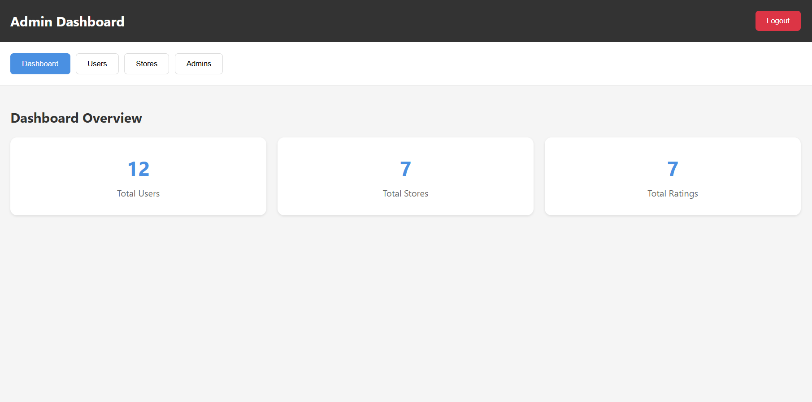
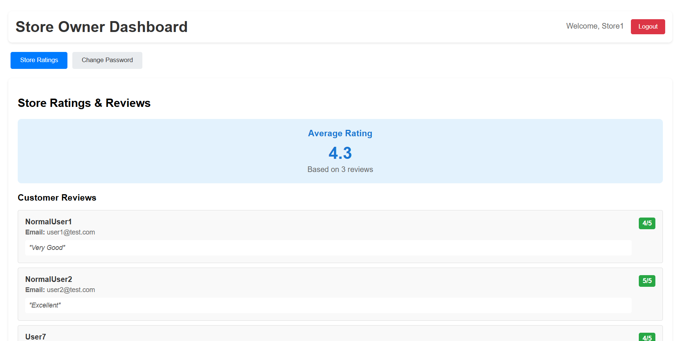
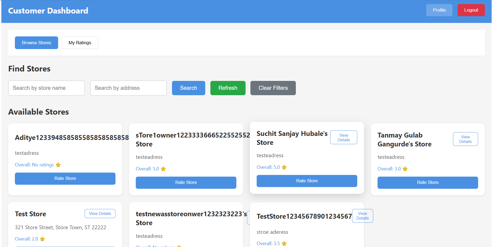

# RateStore


A comprehensive web application for managing stores, users, and ratings with role-based access control. Features separate dashboards for System Administrators, Normal Users, and Store Owners.
### Demo Video
[[Watch the Demo]](Demo.mp4)  
*Click on the image above to view the demo video.*

### Screenshots
#### Admin Interface


#### Store Interface

## Table of Contents

- [Features](#features)
- [User Roles](#user-roles)
- [Tech Stack](#tech-stack)
- [Prerequisites](#prerequisites)
- [Installation](#installation)
- [Database Setup](#database-setup)
- [Usage](#usage)
- [API Endpoints](#api-endpoints)
- [Folder Structure](#folder-structure)
- [Form Validations](#form-validations)
- [Troubleshooting](#troubleshooting)

## Features

### System Administrator
- View dashboard with total users, stores, and ratings
- Add new stores, normal users, and admin users
- Filter and sort users by name, email, address, and role
- Filter and sort stores by name, email, and address
- View detailed user information including store owner ratings
- Manage user accounts and store accounts

### Normal User (Customer)
- Sign up and log in to the platform
- Browse and search stores by name and address
- Submit and modify ratings (1-5 scale) for stores
- View personal rating history
- Update account password

### Store Owner
- Log in to dedicated dashboard
- View all ratings and reviews for their store
- See average store rating
- View customer details who rated their store
- Update account password

## User Roles

1. **System Administrator** - Full system access
2. **Normal User** - Customer with rating capabilities
3. **Store Owner** - Store management and rating views

## Tech Stack

- **Frontend**: React 18, Vite, JavaScript (ES6+)
- **Backend**: Node.js, Express.js, JWT Authentication
- **Database**: PostgreSQL
- **Security**: bcrypt password hashing, JWT tokens
- **Styling**: Inline CSS (no external frameworks)

## Prerequisites

- Node.js v16 or higher
- PostgreSQL v12 or higher
- npm or yarn package manager

## Installation

### 1. Clone the Repository
```bash
git clone <repository-url>
cd RateStore
```

### 2. Backend Setup
```bash
cd backend
npm install
```

Create `.env` file in backend directory:
```env
=======
RateStore is a full‑stack web application for managing **users, stores, and ratings**. It includes an **Admin Dashboard** (totals & management), **Customer** views (browse stores & rate), and **Store Owner** views (see ratings). The stack is **React + Node/Express + PostgreSQL**, with **JWT** authentication.

---
<video src="./DemoVideo.mp4" controls width="600"></video>
[▶️ Watch Demo Video](./DemoVideo.mp4)

  


## ✨ Features

* **Authentication**: Signup/Login with JWT; protected role routes (admin, normal, store\_owner)
* **Admin**:

  * Dashboard (totals: users, stores, ratings)
  * Manage users (add, filter, sort, details)
  * Manage stores (add, filter, sort, details, avg rating)
  * Manage admins (add/view)
* **Customer**: Browse & filter stores, submit ratings & reviews
* **Store Owner**: View ratings for owned store(s)
* **Validation**: Email format; password policy; field length limits
* **Responsive UI**: Clean desktop & mobile layout

---

## 🧰 Tech Stack

* **Frontend**: React, React Router, Fetch/Axios
* **Backend**: Node.js, Express, JWT (jsonwebtoken), bcrypt
* **Database**: PostgreSQL
* **Tooling**: npm, VS Code, Postman (optional)

---

## ✅ Prerequisites

* **Node.js** v14+ (v18+ recommended)
* **PostgreSQL** v12+
* **Git** (to clone)
* **A modern browser** (Chrome/Edge/Firefox)

---

## ⚙️ Setup & Installation

### 1) Clone the repository

```bash
git clone https://github.com/yourusername/ratestore.git
cd ratestore
```

### 2) Backend setup

```bash
cd backend
npm install
```

Create **.env** in `backend/`:

```env
PORT=5000
DB_HOST=localhost
DB_USER=postgres
DB_PASSWORD=yourpassword
>>>>>>> b120a3735a275ab9bba4860d9a87fc831c89baf7
DB_NAME=store_ratings
DB_USER=postgres
DB_PASSWORD=your_password
DB_HOST=localhost
DB_PORT=5432
<<<<<<< HEAD
JWT_SECRET=your-secret-key-for-ratestore-app-2024
PORT=5000
```

### 3. Frontend Setup
```bash
cd ../frontend
npm install
```

## Database Setup

1. **Create Database**:
```bash
psql -U postgres
```

2. **Run the SQL script**:
```bash
psql -U postgres -f backend/database.sql
```

Or manually execute the commands in `backend/database.sql`

3. **Create Initial Admin User** (optional):
```bash
cd backend
node setup-admin.js
```

## Usage

### Start the Application

1. **Start Backend**:
```bash
cd backend
npm start
# Server runs on http://localhost:5000
```

2. **Start Frontend**:
```bash
cd frontend
npm run dev
# App runs on http://localhost:5173
```

### Access the Application

Open `http://localhost:5173` in your browser.

**Default Login Credentials** (if you ran setup-admin.js):
- Email: `admin@ratestore.com`
- Password: `Admin@123`

## API Endpoints

### Authentication
- `POST /signup` - User registration (normal users only)
- `POST /login` - User login (all roles)
- `GET /profile` - Get user profile
- `POST /logout` - User logout

### Admin Routes (`/admin`)
- `GET /dashboard` - Dashboard statistics
- `GET /users` - List/filter users
- `POST /users` - Add new user
- `GET /users/:id` - View user details
- `GET /stores` - List/filter stores
- `POST /stores` - Add new store (creates store owner account)
- `PATCH /password` - Update admin password

### Customer Routes (`/customer`)
- `GET /stores` - List/search stores with ratings
- `POST /ratings` - Submit/modify store rating
- `GET /my-ratings` - Get user's rating history
- `PATCH /password` - Update customer password

### Store Owner Routes (`/storeowner`)
- `GET /ratings` - View store ratings and average
- `PATCH /password` - Update store owner password

## Folder Structure

```
RateStore/
├── backend/
│   ├── routes/
│   │   ├── admin.js          # Admin-specific routes
│   │   ├── customer.js       # Customer-specific routes
│   │   └── storeowner.js     # Store owner routes
│   ├── auth.js               # JWT authentication middleware
│   ├── config.js             # Configuration settings
│   ├── db.js                 # Database connection
│   ├── index.js              # Main server file
│   ├── database.sql          # Database schema
│   ├── .env                  # Environment variables
│   └── package.json          # Backend dependencies
├── frontend/
│   ├── src/
│   │   ├── components/
│   │   │   ├── Login.jsx           # Login component
│   │   │   ├── Signup.jsx          # Signup component
│   │   │   ├── AdminDashboard.jsx  # Admin dashboard
│   │   │   ├── CustomerDashboard.jsx # Customer dashboard
│   │   │   └── StoreOwnerDashboard.jsx # Store owner dashboard
│   │   ├── App.jsx           # Main app component
│   │   └── main.jsx          # App entry point
│   ├── index.html            # HTML template
│   ├── package.json          # Frontend dependencies
│   └── vite.config.js        # Vite configuration
├── .gitignore                # Git ignore rules
└── README.md                 # Project documentation
```

## Form Validations

### User Registration/Creation
- **Name**: Required (any length, not empty)
- **Email**: Valid email format required
- **Address**: Maximum 400 characters
- **Password**: 8-16 characters, at least one uppercase letter and one special character (!@#$&*)

### Store Creation
- **Store Name**: Required
- **Email**: Valid email format required
- **Address**: Maximum 400 characters
- **Password**: 8-16 characters, at least one uppercase letter and one special character

### Ratings
- **Rating**: Integer between 1-5
- **Comment**: Optional, maximum 500 characters

## Troubleshooting

### Database Connection Issues
- Ensure PostgreSQL is running
- Verify `.env` credentials match your PostgreSQL setup
- Check if database `store_ratings` exists

### Authentication Issues
- Verify JWT_SECRET is set in `.env` file
- Check if token is properly stored in localStorage
- Ensure user has correct role permissions

### API Errors
- Check backend server is running on port 5000
- Verify CORS is enabled for frontend requests
- Check browser console for detailed error messages

### Frontend Issues
- Ensure frontend is running on port 5173
- Check if all components are properly imported
- Verify API endpoints match backend routes

## Development

### Running Tests
```bash
cd backend
node test-api.js          # Test API endpoints
node test-complete-system.js  # Full system test
```

### Database Management
```bash
# Connect to database
psql -U postgres -d store_ratings

# View tables
\dt

# View users
SELECT * FROM users;

# View stores
SELECT * FROM stores;
```

## License

MIT License. See LICENSE file for details.
=======
JWT_SECRET=your_jwt_secret
```

#### Create the database & tables

```sql
-- In a terminal
psql -U postgres

-- Create DB
CREATE DATABASE store_ratings;
\c store_ratings

-- Users
CREATE TABLE users (
  id SERIAL PRIMARY KEY,
  name VARCHAR(60) NOT NULL,
  email VARCHAR(255) UNIQUE NOT NULL,
  password VARCHAR(255) NOT NULL,
  address VARCHAR(400),
  role VARCHAR(20) NOT NULL CHECK (role IN ('admin','normal','store_owner'))
);

-- Stores  (aligned with backend: /signup inserts owner_id, NOT a password)
CREATE TABLE stores (
  id SERIAL PRIMARY KEY,
  name VARCHAR(100) NOT NULL,
  email VARCHAR(255),
  address VARCHAR(400),
  owner_id INTEGER UNIQUE REFERENCES users(id) ON DELETE CASCADE,
  avg_rating DECIMAL(3,1) DEFAULT 0
);

-- Ratings
CREATE TABLE ratings (
  id SERIAL PRIMARY KEY,
  store_id INTEGER NOT NULL REFERENCES stores(id) ON DELETE CASCADE,
  user_id INTEGER NOT NULL REFERENCES users(id) ON DELETE CASCADE,
  rating INTEGER NOT NULL CHECK (rating BETWEEN 1 AND 5),
  review TEXT,
  created_at TIMESTAMP DEFAULT CURRENT_TIMESTAMP,
  UNIQUE (user_id, store_id)
);
```

> **Note**: If you previously created a `stores` table with a `password` column, drop & recreate it to match the backend logic:
>
> ```sql
> DROP TABLE IF EXISTS ratings;
> DROP TABLE IF EXISTS stores;
> -- then re-run the CREATE TABLE stores & ratings shown above
> ```

#### Start the backend

```bash
npm run dev   # or: node index.js
```

The server should print: `Server running on port 5000`.

### 3) Frontend setup

```bash
cd ../frontend
npm install
npm start
```

The app runs at **[http://localhost:3000](http://localhost:3000)**.

---

## 🔐 Auth Flow & API Examples

### Signup

`POST http://localhost:5000/signup`

```json
{
  "name": "John Customer Long Name Example",
  "email": "john@example.com",
  "address": "123 Main St",
  "password": "Strong@123",
  "role": "normal"  // or "store_owner"
}
```

> Password policy (from backend): 8–16 chars, **at least one uppercase** & **one special** `!@#$&*`.

If `role === "store_owner"`, backend auto-creates a default store linked via `owner_id`.

### Login

`POST http://localhost:5000/login`

```json
{
  "email": "john@example.com",
  "password": "Strong@123"
}
```

**Response** (as implemented):

```json
{
  "token": "<JWT>",
  "user": {
    "id": 1,
    "name": "John Customer Long Name Example",
    "email": "john@example.com",
    "role": "normal"
  }
}
```

> In the frontend, save `token` and `user.role`. Example: `localStorage.setItem('token', token); localStorage.setItem('role', user.role);`

### Protected example (profile)

`GET http://localhost:5000/profile`

Headers:

```
Authorization: Bearer <JWT>
```

### Admin examples

* List admins: `GET http://localhost:5000/admin/admins`
* Add admin: `POST http://localhost:5000/admin/admins`

All admin routes require: `Authorization: Bearer <JWT>` with an admin user.

---


```


---

## 🧪 Seeding (optional)

Insert an initial admin (password must be **bcrypt** hash if you insert directly):

```sql
INSERT INTO users (name, email, password, address, role)
VALUES (
  'System Administrator Test User',
  'admin@test.com',
  '$2b$10$abcdefghijklmnopqrstuv1234567890abcdEFGHijklmnoPQRStU',
  '123 Admin St',
  'admin'
);
```

> Or use the app’s signup + role switch in DB for quick local testing.

---

## 🧭 Frontend Integration Notes

* Every protected request must include the header:

  ```http
  Authorization: Bearer <token>
  ```
* In `api.jsx`, prefer a **shared response handler** that throws on non‑OK responses and auto‑handles `401` (e.g., clear token & redirect to `/login`).
* When rendering lists (e.g., stores), **defensively** coerce to arrays to avoid `stores.map is not a function` when an error payload is returned:

  ```js
  setStores(Array.isArray(data) ? data : []);
  ```

---

## 🛡️ Troubleshooting

### 401 Unauthorized on frontend

* Confirm you’re saving `response.user.role` (not `response.role`) from `/login`.
* Ensure requests include `Authorization: Bearer <token>`.
* Check that your backend `JWT_SECRET` in `.env` matches what signed the token.

### PostgreSQL cannot connect (Windows)

* Start the service via **Services** (`services.msc`) → PostgreSQL → Start.
* Or reinstall with *Install as a Service* enabled.

### psql prompt stuck at `-#`

* You have an incomplete SQL statement. Press **Ctrl+C**, then re‑run with a semicolon `;`.

### `stores.map is not a function`

* The fetch likely returned an error object. Guard in React and log the response.

### CORS

* Backend uses `cors()` globally. If hosting separately, configure `cors({ origin: '<frontend-origin>', credentials: true })`.

---


---

## 📄 License

MIT License. See `LICENSE` for details.
>>>>>>> b120a3735a275ab9bba4860d9a87fc831c89baf7
